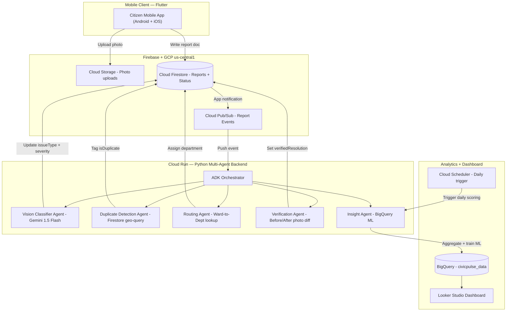
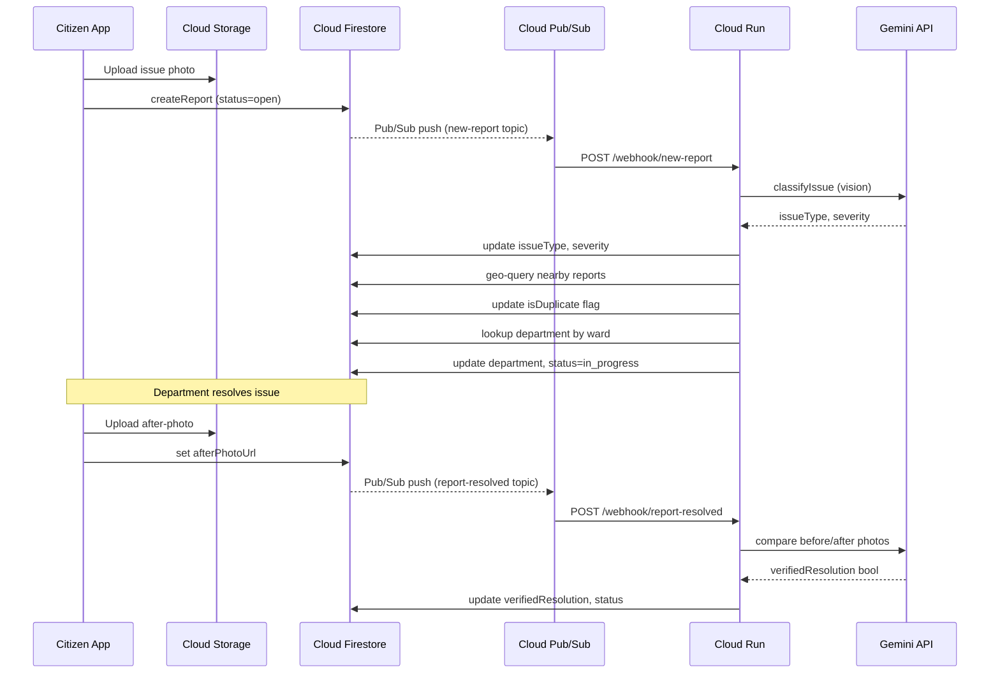
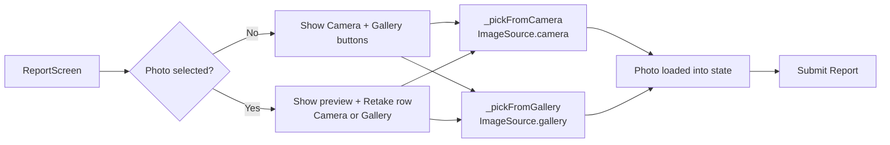

# CivicPulse — Architecture Specification

> **Google Cloud Project:** `civicpulse-507101` · **Region:** `us-central1`

---

## 1. System Topology



---

## 2. Request Lifecycle



---

## 3. Frontend — Flutter App

### 3.1 Screens

| Screen | File | Description |
|---|---|---|
| **HomeScreen** | `lib/screens/home_screen.dart` | Landing page with CTA to report an issue and navigate to reports list. |
| **ReportScreen** | `lib/screens/report_screen.dart` | Photo picker (Camera + Gallery), GPS detection, Gemini AI classification, Firestore submission, pipeline trigger. |
| **SuccessScreen** | `lib/screens/success_screen.dart` | Confirmation showing generated `reportId` and AI classification result. |
| **ReportsListScreen** | `lib/screens/reports_list_screen.dart` | Real-time Firestore stream of reports with status chips, severity badges, verification upload, and debug pipeline FAB. |

### 3.2 Services

| Service | File | Responsibilities |
|---|---|---|
| **GeminiService** | `lib/services/gemini_service.dart` | Reads photo bytes → base64 → POST to `gemini-1.5-flash:generateContent`. Parses JSON for `issueType`, `severity`, `confidence`, `description`. Full error logging on non-200. |
| **FirestoreService** | `lib/services/firestore_service.dart` | `createReport()` generates `CP-{ts}-{rand}` ID, writes to Firestore. `triggerAgentPipeline()` POSTs base64 Pub/Sub payload to Cloud Run. `getReports()` returns real-time stream by `createdAt desc`. |
| **StorageService** | `lib/services/storage_service.dart` | Uploads before/after photos to Firebase Storage under `reports/{reportId}/{type}.jpg`. Returns signed download URL. |

### 3.3 Photo Source Flow



---

## 4. Backend — Python Multi-Agent Service

### 4.1 API Endpoints

| Endpoint | Trigger | Action |
|---|---|---|
| `POST /webhook/new-report` | Pub/Sub push | Decodes base64 payload, runs DuplicateAgent then RoutingAgent. Always returns HTTP 200. |
| `POST /webhook/report-resolved` | Pub/Sub push | Decodes base64 payload, runs VerificationAgent. Always returns HTTP 200. |
| `POST /webhook/daily-insight` | Cloud Scheduler | Runs InsightAgent (BigQuery ML). Always returns HTTP 200. |
| `GET /health` | Health checks | Returns `{"status": "ok"}`. |

> **Critical:** All webhooks return HTTP 200 unconditionally to prevent Pub/Sub infinite retry loops.

### 4.2 Agents

| Agent | File | Technology | Responsibility |
|---|---|---|---|
| **Orchestrator** | `agents/orchestrator.py` | Google ADK | Coordinates pipeline and manages shared state. |
| **Vision Classifier** | `agents/vision_classifier.py` | Gemini 1.5 Flash | Outputs `issueType` and `severity` from citizen photo. |
| **Duplicate Detection** | `agents/duplicate_detection.py` | Firestore geo-query | Checks ~50m radius; sets `isDuplicate=true` and `parentReportId`. |
| **Routing** | `agents/routing.py` | Firestore lookup | Maps `ward + issueType` to `departments` collection; assigns department and advances status to `in_progress`. |
| **Verification** | `agents/verification.py` | Gemini Vision | Compares before/after photos; sets `verifiedResolution` and `verificationNotes`. |
| **Insight** | `agents/insight.py` | BigQuery ML | Spatial hot-spot risk scoring; writes to `predictions` collection. |

### 4.3 Backend Services

| Service | File | Responsibility |
|---|---|---|
| **FirestoreClient** | `services/firestore_client.py` | Async Firestore reads/writes. |
| **GeminiClient** | `services/gemini_client.py` | Wraps `google-generativeai`; caches duplicate prompts. |
| **BigQueryClient** | `services/bigquery_client.py` | Parameterized queries — never `SELECT *`, always date-filtered. |

### 4.4 Environment Variables (`backend/.env`)

| Variable | Description |
|---|---|
| `GEMINI_API_KEY` | Google AI Studio API key |
| `GOOGLE_CLOUD_PROJECT` | GCP project ID (`civicpulse-507101`) |
| `FIRESTORE_DATABASE` | Firestore database ID |
| `BIGQUERY_DATASET` | Dataset name (`civicpulse_data`) |
| `API_BASE_URL` | Cloud Run service URL (used by Flutter frontend) |

---

## 5. Firestore Data Schema

### 5.1 `reports/{reportId}`

| Field | Type | Description |
|---|---|---|
| `reportId` | `string` | `CP-{timestamp}-{rand4}` unique identifier |
| `citizenId` | `string` | Anonymized citizen ID |
| `photoUrl` | `string` | Signed URL of the before-photo |
| `afterPhotoUrl` | `string?` | Signed URL of the resolution photo |
| `latitude` | `number` | GPS latitude |
| `longitude` | `number` | GPS longitude |
| `ward` | `string` | Municipal ward (e.g. `Ward_3`) |
| `issueType` | `string` | `pothole`, `garbage`, `streetlight`, `leakage`, `road_damage` |
| `severity` | `string` | `low`, `medium`, `critical` |
| `status` | `string` | `open`, `in_progress`, `resolved`, `false_closure` |
| `department` | `string` | Assigned municipal department |
| `isDuplicate` | `boolean` | `true` if a nearby open report already exists |
| `parentReportId` | `string?` | Links to original report when `isDuplicate=true` |
| `createdAt` | `Timestamp` | Firestore server timestamp at submission |
| `resolvedAt` | `Timestamp?` | Resolution timestamp |
| `verifiedResolution` | `boolean?` | AI verification result (`null` = pending) |
| `verificationNotes` | `string?` | AI reasoning for verification decision |

### 5.2 `departments/{deptId}`

| Field | Type | Description |
|---|---|---|
| `deptId` | `string` | Department identifier |
| `name` | `string` | Display name |
| `contactEmail` | `string` | Contact email |
| `wardCoverage` | `string[]` | Wards this department serves |
| `supportedCategories` | `string[]` | Issue types this department handles |

### 5.3 `predictions/{predId}`

| Field | Type | Description |
|---|---|---|
| `predId` | `string` | Prediction record ID |
| `ward` | `string` | Ward identifier |
| `riskScore` | `number` | ML-generated risk score (0.0–1.0) |
| `predictedIssueType` | `string` | Most likely upcoming issue type |
| `generatedAt` | `Timestamp` | Prediction generation timestamp |

---

## 6. Infrastructure

### Cloud Run Deployment

```bash
gcloud run deploy civicpulse-backend \
  --source backend/ \
  --region us-central1 \
  --max-instances 2 \
  --memory 512Mi \
  --project civicpulse-507101
```

### Pub/Sub Topics

| Topic | Subscription | Consumer |
|---|---|---|
| `new-report` | `new-report-sub` (push) | `POST /webhook/new-report` |
| `report-resolved` | `report-resolved-sub` (push) | `POST /webhook/report-resolved` |

### Cloud Scheduler

```
Schedule: 0 2 * * *   (daily at 02:00 UTC)
Target:   POST https://{cloud-run-url}/webhook/daily-insight
```

---

## 7. Cost Controls

| Service | Rule |
|---|---|
| **Cloud Run** | `max-instances=2`, `memory=512Mi` on all deployments |
| **BigQuery** | Always specify columns explicitly; never `SELECT *`; always apply date/partition filters |
| **Firestore** | Stay under 20 000 writes/day and 50 000 reads/day; batch and cache where possible |
| **GCP Region** | All services exclusively in `us-central1` |
| **Gemini API** | Cache duplicate prompts; never expose keys in client code or version control |
