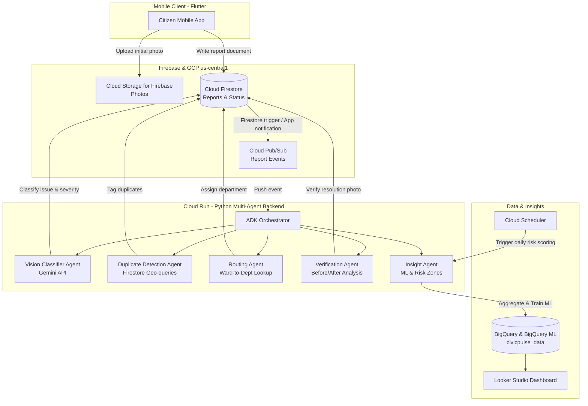

# CivicPulse Architecture Specification

## 1. System Topology

## 2. Multi-Agent System (Google ADK)

| Agent | Technology | Responsibility |
|---|---|---|
| **Vision Classifier Agent** | Gemini 1.5 / 2.0 Flash (Google AI Studio) | Analyzes citizen photo, determines `issueType` (`pothole`, `garbage`, `streetlight`, `leakage`, `road_damage`), and rates `severity` (`low`, `medium`, `critical`). |
| **Duplicate Detection Agent** | Python + Firestore Geo-radius | Checks nearby pending/open reports within a geographic radius (e.g., 50m) to mark `isDuplicate=true` and link `parentReportId`. |
| **Routing Agent** | Firestore `departments` collection lookup | Maps geographical ward and issue category to responsible municipal department. |
| **Verification Agent** | Gemini Vision API | Compares the initial photo (`photoUrl`) with worker resolution photo (`afterPhotoUrl`) to validate true issue resolution. |
| **Insight Agent** | BigQuery ML + Cloud Scheduler | Computes recurring spatial hot-spot risk scores and generates predictions in the `predictions` collection. |

## 3. Data Schema & Collections

### 3.1 `reports/{reportId}`
- `reportId`: `string`
- `citizenId`: `string`
- `photoUrl`: `string`
- `afterPhotoUrl`: `string?`
- `latitude`: `number`
- `longitude`: `number`
- `ward`: `string`
- `issueType`: `string` (values: `pothole`, `garbage`, `streetlight`, `leakage`, `road_damage`)
- `severity`: `string` (values: `low`, `medium`, `critical`)
- `status`: `string` (values: `open`, `in_progress`, `resolved`, `false_closure`)
- `department`: `string`
- `isDuplicate`: `boolean`
- `parentReportId`: `string?`
- `createdAt`: `Timestamp`
- `resolvedAt`: `Timestamp?`
- `verifiedResolution`: `boolean?`
- `verificationNotes`: `string?`

### 3.2 `departments/{deptId}`
- `deptId`: `string`
- `name`: `string`
- `contactEmail`: `string`
- `wardCoverage`: `string[]`
- `supportedCategories`: `string[]`

### 3.3 `predictions/{predId}`
- `predId`: `string`
- `ward`: `string`
- `riskScore`: `number`
- `predictedIssueType`: `string`
- `generatedAt`: `Timestamp`
